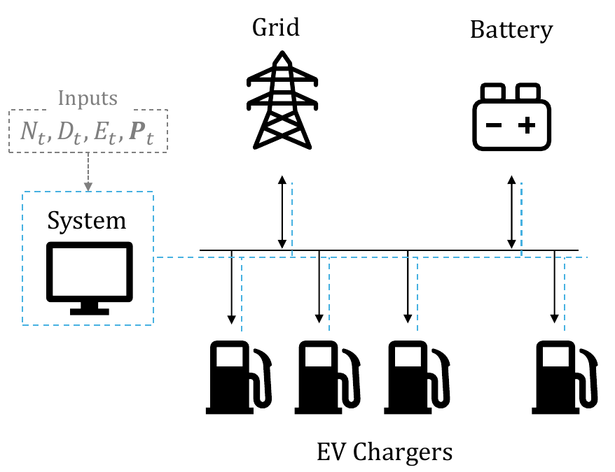
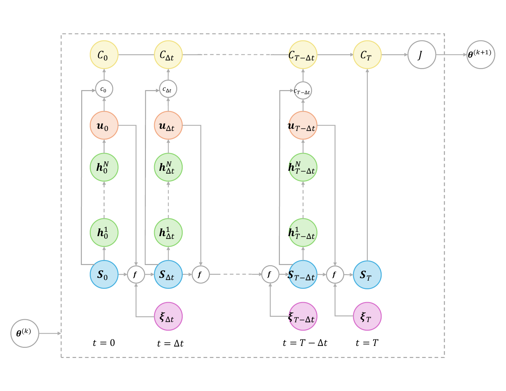
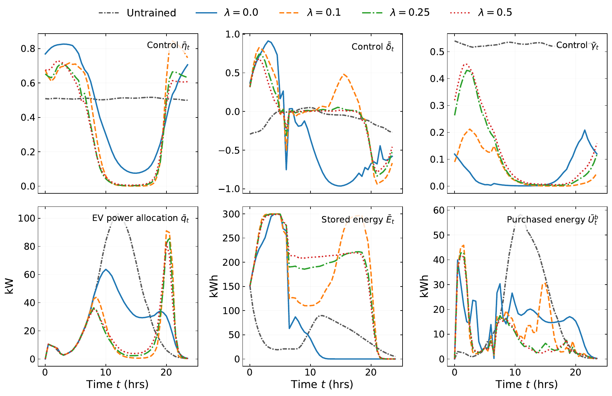
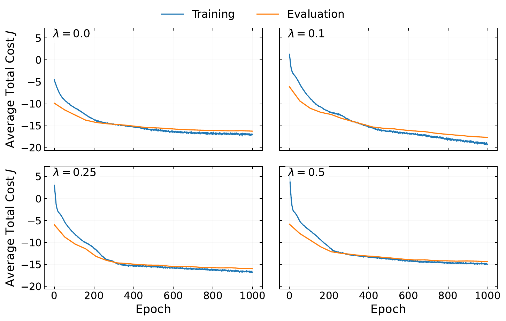
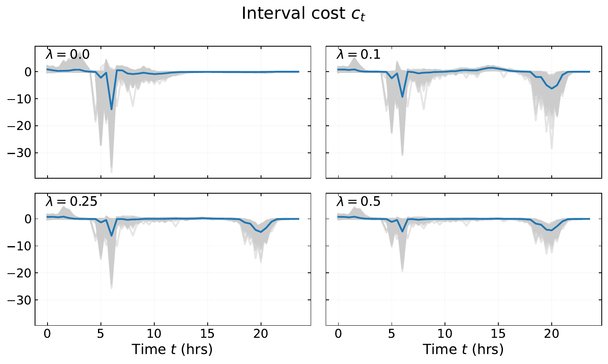

# Stochastic Energy Management System
Energy Management System with grid and battery control under stochastic electricity prices and EV arrival/departure dynamics.

## Overview

This repository contains a simplified Energy Management System (EMS) for EV charging under stochastic electricity prices and stochastic EV arrival/departure processes.

The current implementation considers:

- grid interaction
- battery dynamics
- homogeneous EVs
- stochastic electricity prices
- stochastic EV arrival/departure behavior
- neural-network-based control policies

The repository is intended as supplementary material for the associated research work and contains:

- implementation details
- experimental notebooks
- trajectory analysis
- additional figures and results related to the experiments

### EMS Architecture

The following diagram illustrates the general EMS structure considered in this repository, including stochastic inputs, grid interaction, battery dynamics, and EV charging allocation.

<p align="center">
  
</p>

### Optimization Workflow

The following diagram summarizes the sequential optimization and rollout structure used during policy training and trajectory generation.
<p align="center">
  
</p>

## Repository Structure

```bash
.
├── data/             # External input data (not distributed with the repository)
├── figures/          # Generated figures and evaluation results
├── notebooks/        # Training, experimentation, and analysis notebooks
├── source/           # Core EMS implementation and supporting modules
├── styles/           # Plotting and visualization styles
├── README.md
├── requirements.txt
└── .gitignore
```

The `source/` directory contains the core implementation of the Energy Management System, including:

- diagnostics
- plotting utilities
- neural policies
- simulation components
- stochastic processes
- system dynamics
- training routines
- general utilities

### Data Availability

The electricity price data used in this work is not included in the repository.

The original price information was obtained from the ERCOT Real-Time Settlement Point Prices (SPP) dataset:

[ERCOT Real-Time Settlement Point Prices (SPP)](https://www.ercot.com/content/cdr/html/real_time_spp.html)

The experiments were conducted using a preprocessed subset of the original ERCOT data.


## Notebooks

### 00 — Sanity Checks

Contains:
- environment validation
- dependency verification
- preliminary testing utilities


### 01 — Training Demo

Implements:
- neural policy training
- stochastic trajectory rollouts
- objective function optimization
- training diagnostics


### 02 — Lambda Experiments

Contains:
- policy training under different λ values
- checkpoint generation
- comparative training runs

**Note:** Trained checkpoints are saved to the `checkpoints/` directory. This directory is not distributed with the repository and is generated locally during training.

### 03 — Results

Generates:
- final evaluation figures
- trajectory summaries
- cost analysis
- policy comparison plots
- figures used in the associated research work

## Example Results

### Main Trajectory Summary

Average trajectories under different parameter configurations, illustrating the temporal evolution of battery energy, power allocation, charging/discharging dynamics, and grid energy purchase.

<p align="center">
  
</p>

High-resolution figure:
[PDF version](figures/lambda_mean_trajectory_summary.pdf)


### Training Convergence

Training and evaluation average total cost trajectories across different parameter configurations during policy optimization.

<p align="center">
  
</p>

High-resolution figure:
[PDF version](figures/objective_vs_epochs.pdf)


### Interval Cost Trajectories

Interval cost evolution under different parameter configurations. Gray trajectories correspond to individual realizations, while the blue curve represents the average behavior.

<p align="center">
  
<\p>

High-resolution figure:
[PDF version](figures/lambda_cost_many.pdf)


## Notes

- The repository follows a research-oriented workflow built around reusable Python modules and Jupyter notebooks.
- Figures are provided in PDF format for high-resolution visualization and PNG format for README previews.
- The code is intended as supplementary material accompanying the associated research work.


## Author
Denisse Urenda Castañeda

PhD Student in Data Science — UTEP
